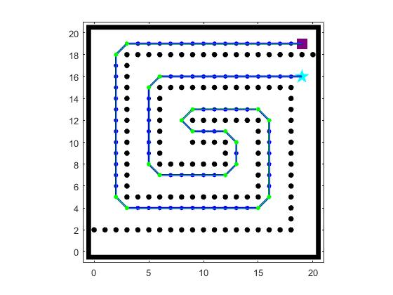

# PathPlanning-MATLAB

Single robot path planning algorithms implemented in MATLAB.
Including heuristic search and incremental heuristic search methods.

(Procedural programming)

<table style="padding:10px">
  <tr>
    <td></td>
    <td></td>
  </tr>
</table>

## Methods

- A* (can turn into Dijkstra by changing the heuristic function)
- LPA*(Life Long Planning A*)
- D*Lite (With Optimized Version)

## Run

- Go into the methods directory.
- Run the **RUN_[Methods_name].m** file

## General

Apart from each path planning method's directory, there are two general directories:

- **common**: common functionalities used in all planning methods
- **models**: functions for creating and saving models (configurations).

## Common Settings

can change this setting in the RUN_[method].m file

- distance type: **Model.distType** ('euclidean' or 'manhattan')
- distance type: **Model.adjType** ('4adj' or '8adj')
- expansion method: **Model.expandMethod**
  - 'random': onlly based on distance cost
  - 'heading': based on distance and heading
- create_model_method: 'from_map_file', 'from_samples', 'from_custom'

## Configuration - Models

Initial configuration includes:

- Map (free nodes)
- obstacles (occupied nodes)
- robot's start node
- robot's goal node
- ...

There are three methods to create initial configuration (model):

- **from_map_file**: from a map.mat file (square matrix, 0: occupied, 1: free)
- **from_samples**: from a list of ready samples
- **from_custom**: from createModelBase.m file which you can edit and customize

You can set the method in the RUN_p[method].m file.

To change the configuration in *from_custom* method, you can edit the **createModelBase.m** file in **models** directory.

## A*

Includes final path modification (green path in the simulation pictures).

## Simulations

### A*

<table style="padding:10px">
  <tr>
    <td></td>
    <td></td>
    <td></td>
  </tr>
</table>

### LPA* and D*Lite

<table style="padding:10px">
  <tr>
    <td></td>
  </tr>
</table>

## Resources
- Koenig, S., & Likhachev, M. (2002, July). D* lite. In Eighteenth national conference on Artificial intelligence (pp. 476-483).
- E. Khanmirza, M. Haghbeigi, M. Nazarahari and S. Doostie, "A Comparative Study of Deterministic and Probabilistic Mobile Robot Path Planning Algorithms," 2017 5th RSI International Conference on Robotics and Mechatronics (ICRoM) [Link](https://ieeexplore.ieee.org/abstract/document/8466197)